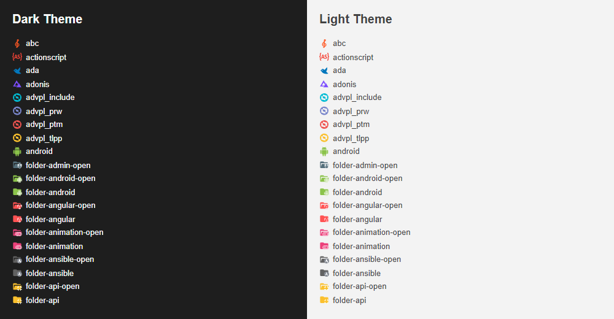
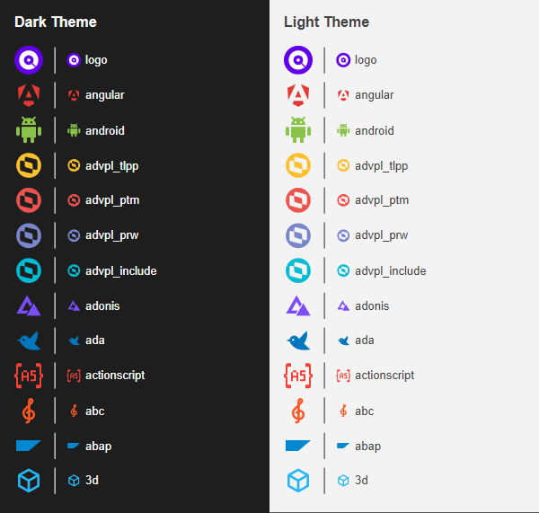

<h1 align="center">
  <br>
    
  <br><br>
  SVG Icon Review
  <br>
  <br>
</h1>

<h4 align="center">Tool to review SVG icons automatically</h4>

## CLI Command

The tool can be executed with this command:

```
bunx svg-icon-review file1.svg file2.svg
```

It also supports glob file patterns to check multiple files matching the pattern like this:

```
bunx svg-icon-review ./images/**/*.svg
```

The output is a preview of how the icons look in either dark or light backgrounds:



## Options

### `--bigIcon`

Optionally, an additional bigger icon (in size of 32x32px) will be shown in front of the preview. This is useful to see the icon in more detail. This can be done by adding the `--bigIcon` option like this:

```bash
bunx svg-icon-review --bigIcon file1.svg file2.svg
```

The preview will look like this:



### `--silent`

By default, the tool will output a result message to the console. If you want to avoid this output, you can use the `--silent` option:

```bash
bunx svg-icon-review --silent file1.svg file2.svg
```

### `--debug`

If you want to see the debug information, you can use the `--debug` option:

```bash
bunx svg-icon-review --debug file1.svg file2.svg
```

### `--noSandbox`

By default, the tool uses a sandboxed environment to render the SVG icons. If you want to disable this sandbox, you can use the `--noSandbox` option:

```bash
bunx svg-icon-review --noSandbox file1.svg file2.svg
```

Running without a sandbox is strongly discouraged because of security risks. Consider configuring a sandbox instead. If you absolutely trust the content you with this tool, you can launch it with the --noSandbox argument.

### `--help`

If further help is needed, the `--help` option can be used:

```bash
bunx svg-icon-review --help
```

> Instead of "bunx" you can use "npx" if you prefer Node.js.

## Development

For the development of this tool, Bun.js is used. First you have to install the dependencies:

```bash
bun install
```

Then you can run the tool with:

```bash
bun run start
```

It is going to create a preview image of the logo.svg file in the root directory.

### Formatting and Linting

To format the code, run:

```bash
bun run format
```

To lint the code, run:

```bash
bun run lint
```
